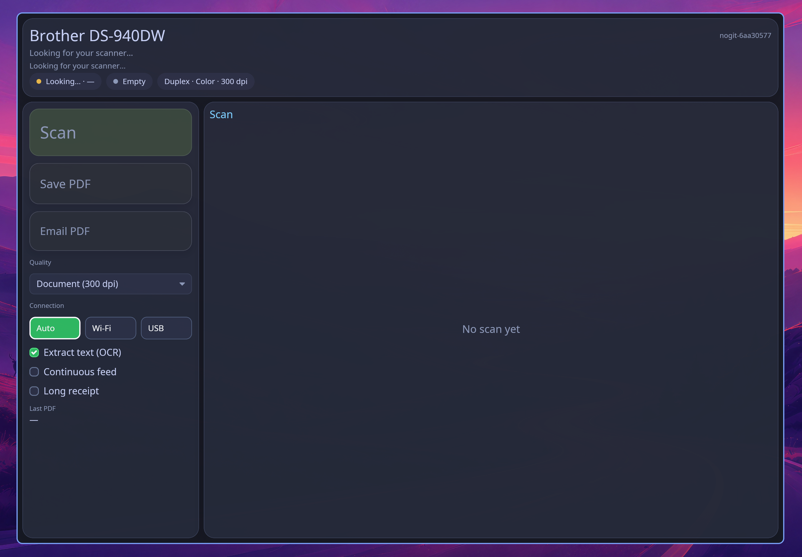

# Scanbro

Scan from a Brother scanner. Save a PDF, or email a copy under 5 MB.

Made for [Omarchy](https://omarchy.org).

<p align="center">
  
</p>

## Features

- Finds the scanner on Wi-Fi or USB
- Scans both sides in colour
- Add more sheets without starting over
- Long receipts (one side, extra long)
- Quality from 150 to 600 dpi (300 by default)
- Preview pages and see the file size
- Save a full-quality PDF
- Email a copy kept under 5 MB
- Optional text extraction

Tested with the Brother DS-940DW. Other Brother scanners are planned.

## Build

```bash
cargo build --release
install -Dm755 target/release/scanbro ~/.local/bin/scanbro
install -Dm644 scanbro.desktop ~/.local/share/applications/scanbro.desktop
```
